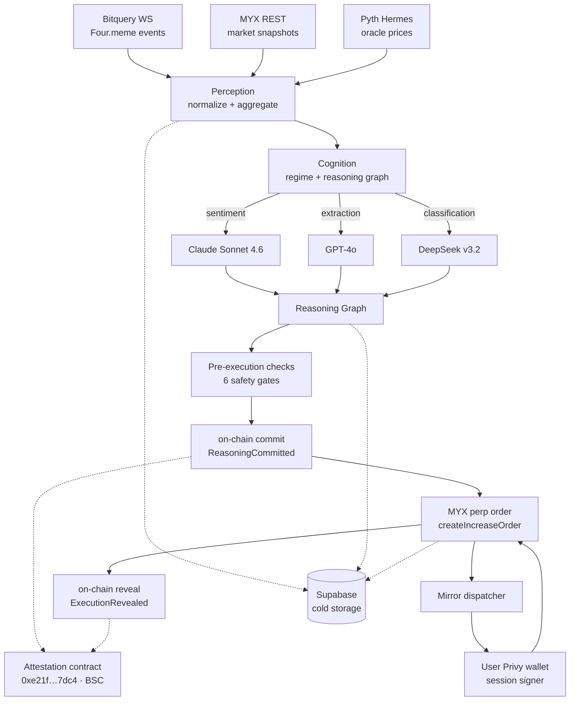

# NeuroDegen

An autonomous execution agent for BNB Chain. Ingests Four.meme bonding-curve signals, reasons across three LLM providers, executes hedged perpetual positions on MYX Finance, mirrors to user wallets via Privy session signers, and emits every decision as a verifiable on-chain attestation.

The product is the composition, not the alpha. NeuroDegen does not claim profitable trading. It demonstrates end-to-end agentic execution under real conditions with a cryptographically verifiable link between each reasoning graph and the MYX order it produced.

---

## Live Deployment

| Artifact | Value |
|---|---|
| **Chain** | BNB Smart Chain (mainnet, chainId 56) |
| **Agent wallet** | [`0x9fe816A8bD6933464c177ba94890aEDE5CD5aA5A`](https://bscscan.com/address/0x9fe816A8bD6933464c177ba94890aEDE5CD5aA5A) |
| **Attestation contract** | [`0xe21f5ebec3f098c744c1e35db0c9338d6b717dc4`](https://bscscan.com/address/0xe21f5ebec3f098c744c1e35db0c9338d6b717dc4) |
| **Deploy tx** | [`0x0d1c472c...e37d64630a0`](https://bscscan.com/tx/0x0d1c472cd1cbffbdf57252e06b09295a5da8c76d709eef4360377e37d64630a0) |
| **Smoke: regime attest** | [`0x2a5720bc...eefa8c6e3f7393`](https://bscscan.com/tx/0x2a5720bcf035a4e67069b4d036f072f1ea7d26a0cf322fb657eefa8c6e3f7393) |
| **Smoke: reasoning commit** | [`0xcbd07114...91c2bd8f7f68`](https://bscscan.com/tx/0xcbd07114790424553ddcc04190931f71a428011a35dd09b3a7b591c2bd8f7f68) |
| **Smoke: execution reveal** | [`0x7dea3fc4...e409c1321d`](https://bscscan.com/tx/0x7dea3fc4c07c662aae3c076ab93468f8cd9f34cde6e203e0bd36d7e409c1321d) |

Every position open, position close, regime change, reasoning commit, and execution reveal is written to the attestation contract. Anyone can reconstruct the chain of custody from BscScan alone — or use the built-in `/proof/[myxTxHash]` page to verify a specific trade in one click.

---

## Architecture



### Layer responsibilities

**Perception** — Bitquery v2 WebSocket subscriptions for five Four.meme events (TokenCreate, TokenPurchase, LiquidityAdded, PairCreated, PoolCreated). MYX REST polling for market snapshots every 15s. Pyth Hermes for BTC/ETH/BNB oracle prices. All events normalized to typed domain objects, pushed through rolling-window aggregators, flushed to Supabase in 5s batches.

**Cognition** — Three-model mixture routed through DGrid. Claude Sonnet 4.6 (Anthropic native `/v1/messages` format) scores narrative sentiment. GPT-4o (OpenAI-compatible `/v1/chat/completions`) extracts structured features. DeepSeek v3.2 (OpenAI-compatible) makes the binary action call. If any DGrid call fails, the fallback handler retries via Anthropic direct with the user's own key, so cognition never hangs waiting on a gateway. Every cycle produces a `ReasoningGraph` capturing all three model calls, inputs, outputs, latencies, and aggregation logic.

**Execution** — MYX v2 perpetuals via the official `@myx-trade/sdk` (pinned `1.0.18`, single-adapter pattern). Pre-execution gate runs six sequential checks (oracle divergence, crowd score from funding rate, slippage headroom, collateral sufficiency, concurrent-position cap, cooldown). Orders are built as `PlaceOrderParams` with SDK-native decimal handling, submitted through `MyxClient.order.createIncreaseOrder`, then tracked through the full keeper state machine (submitted → pending → filled → managed → closed/expired/liquidated).

**Copy-trade monetization** — Users log in via Privy, grant a session-signer scope on their embedded wallet, and set three preferences: leverage multiplier, max position USD, and min confidence threshold. When the agent opens a position, the `MirrorDispatcher` fans out to every active subscription, runs per-user sizing (clamping to each user's limits), builds a `PlaceOrderParams`, and submits through a per-user `MyxClient` that signs with the user's Privy wallet. Users keep their own keys. The agent never holds user funds.

**Attestation** — A minimal immutable contract (`NeurodegenAttestation.sol`) emits an event for every decisive action: `PositionOpened`, `PositionClosed`, `RegimeChanged`, `ReasoningCommitted` (pre-submit, includes `reasoningHash` + `actionIntent`), and `ExecutionRevealed` (post-confirmation, links `reasoningHash` → `myxTxHash` + `orderId`). The commit-reveal pair gives an independent verifier a cryptographic timeline: the agent committed to the reasoning *before* the MYX tx was sent, and revealed the execution pointer *after* it confirmed. Anyone can audit the full chain on-chain without ever trusting our API.

---

## Verifiable proof chain

Go to `/proof/<myxTxHash>` for any NeuroDegen trade. The page:

1. Fetches the `ExecutionRevealed` event on the attestation contract.
2. Extracts the `reasoningHash` and looks up the matching `ReasoningCommitted` event.
3. Fetches the full reasoning graph from Supabase using that hash as the key.
4. Recomputes `keccak256(serialize(graph))` and verifies it matches the on-chain hash.
5. Displays commit timestamp, execution timestamp, time delta, hash match status, and a deep-link to the full reasoning view.

One-line headline: *"Reasoning was committed N seconds before execution. Hash verified."* If the hash mismatches, the page says so in red.

This closes the gap that every analytics-tool competitor leaves open: our LLM reasoning is not only auditable, it is *cryptographically tied to the on-chain action it produced*.

---

## How it lands against each track

- **Main Sprint.** An end-to-end pipeline from Four.meme signal to on-chain MYX order, with every trade carrying a cryptographic commit-before-submit and reveal-after-confirmation recorded on BSC. A judge can pick any MYX transaction we produced, open `/proof/<txHash>`, and confirm the reasoning graph behind it without trusting our API.
- **MYX Finance.** Real perpetual orders through the official `@myx-trade/sdk`. The same execution gateway fans out to Privy-custodied user wallets so one agent trade mirrors to many subscribers.
- **DGrid.** Three providers wired in production: Claude Sonnet 4.6 on `/v1/messages`, GPT-4o and DeepSeek v3.2 on `/v1/chat/completions`. An Anthropic-direct fallback keeps the cognition loop responsive under gateway outages.
- **Pieverse.** A proper x402 HTTP endpoint at `/api/skill` that settles in pieUSD on BSC. Payment proof is verified by fetching the tx receipt and inspecting the `Transfer` log — no shared secrets, no facilitator trust.

---

## Quick start

### Prerequisites
- Node.js 18+
- pnpm 8+
- Supabase project (free tier)
- DGrid API key (dgrid.ai)
- Bitquery v2 Bearer token
- BSC RPC endpoint (QuickNode, Alchemy, or public)
- Privy app (privy.io) with one authorization key registered
- An EOA funded with BNB for gas

### Setup

```bash
git clone <repo-url>
cd neurodegen
pnpm install
cp .env.example .env.local
# Fill in every value — see "Environment variables" below
npx supabase db push  # runs 001 + 002 + 003
pnpm dev
```

### Deploy the attestation contract

```bash
pnpm attestation:compile   # solc → artifacts/NeurodegenAttestation.json
pnpm attestation:deploy    # deploys to BSC, prints address
# copy printed address into .env.local as ATTESTATION_CONTRACT_ADDRESS
# flip ENABLE_ATTESTATION=true in src/config/features.ts
```

### Start the agent

```bash
curl -X POST http://localhost:3000/api/agent/start \
  -H "X-Admin-Secret: $ADMIN_SECRET"
```

### Onboard a user for copy-trade

1. Visit `/onboard`
2. Connect via Privy (email or wallet)
3. Set leverage multiplier, max position USD, min confidence
4. Approve the session-signer grant
5. Fund the displayed embedded wallet address with:
   - **BNB** for gas (~0.01 BNB covers many trades at BSC fees)
   - **USDT** for trade collateral (your chosen max position size × a few cycles)

---

## Production deployment

NeuroDegen is pure Next.js + Supabase + BSC. Vercel + a Supabase project cover the entire runtime.

### 1. Supabase

Create a project and run the three migrations:

```bash
supabase link --project-ref <your-project-ref>
supabase db push   # applies 001_initial_schema + 002_copy_trade + 003_add_wallet_id
```

### 2. Attestation contract

Deploy once, save the address:

```bash
pnpm attestation:ship    # compile + deploy to BSC
# copy the printed address into .env.local as ATTESTATION_CONTRACT_ADDRESS
```

### 3. Vercel

```bash
# Push to GitHub, then:
vercel link              # link the local folder to a Vercel project
vercel env pull .env.local    # or add each env var in the Vercel dashboard
vercel --prod            # production deploy
```

Every variable in `.env.example` must be present in the Vercel project. Set them under **Project Settings → Environment Variables**, scoped to `Production`.

### 4. Domain

Point `neurodegen.xyz` at your Vercel project (Project Settings → Domains), then set `NEXT_PUBLIC_APP_URL=https://neurodegen.xyz` in Vercel env.

### 5. Go live

Flip execution flags in [src/config/features.ts](src/config/features.ts):

```ts
export const ENABLE_EXECUTION: boolean = true;
export const DRY_RUN_MODE: boolean = false;
```

Redeploy. Start the agent:

```bash
curl -X POST https://neurodegen.xyz/api/agent/start \
  -H "X-Admin-Secret: $ADMIN_SECRET"
```

First cycle with a real action will produce a commit → MYX submit → reveal sequence on BscScan. Visit `/proof/<myxTxHash>` to verify.

---

## Environment variables

See [.env.example](.env.example) for the complete, described list. Grouped by concern:

| Group | Vars |
|---|---|
| **Chain** | `BSC_RPC_URL`, `BSC_WSS_URL`, `NEURODEGEN_AGENT_PRIVATE_KEY`, `ATTESTATION_CONTRACT_ADDRESS`, `MYX_BROKER_ADDRESS` |
| **Data** | `BITQUERY_API_KEY`, `PYTH_HERMES_URL`, `MYX_API_URL` |
| **LLM routing** | `DGRID_API_KEY`, `OPENAI_API_KEY`, `ANTHROPIC_API_KEY` |
| **Auth (Privy)** | `NEXT_PUBLIC_PRIVY_APP_ID`, `PRIVY_APP_SECRET`, `PRIVY_AUTH_PRIVATE_KEY`, `PRIVY_VERIFICATION_KEY`, `PRIVY_SIGNER_ID`, `NEXT_PUBLIC_PRIVY_SIGNER_ID` |
| **Storage** | `NEXT_PUBLIC_SUPABASE_URL`, `NEXT_PUBLIC_SUPABASE_ANON_KEY`, `SUPABASE_SERVICE_ROLE_KEY` |
| **Monetization (Pieverse)** | `PIEVERSE_REVENUE_ADDRESS`, `PIEVERSE_PIEUSD_ADDRESS` |
| **Auth to privileged routes** | `ADMIN_SECRET` |

---

## Project structure

```
src/
├── app/
│   ├── api/                    # Route handlers (agent, me, auth, skill, proof, og, health)
│   ├── (agent)/agent/          # Public dashboards
│   ├── onboard/                # User onboarding flow
│   ├── me/                     # User dashboard
│   ├── proof/[txHash]/         # On-chain proof verification page
│   └── reasoning/[id]/         # Full reasoning graph viewer
├── components/
│   ├── ui/                     # Primitives: Card, Button, Badge, Skeleton
│   ├── layout/                 # NavBar, Shell, DarkModeApplier
│   ├── providers/              # PrivyAuthProvider
│   └── features/
│       ├── auth/               # ConnectButton
│       ├── copyTrade/          # UserPositionTable, PreferenceRow
│       ├── perception/         # EventCard, EventFeed, AggregateMetrics
│       ├── cognition/          # RegimeIndicator, ReasoningChainView, ModelCallDetail
│       ├── execution/          # PositionTable, PositionRow, RiskGauge
│       └── landing/            # Hero, ArchitectureDiagram
├── lib/
│   ├── abis/                   # Attestation, Four.meme (MYX uses SDK)
│   ├── auth/                   # Privy session helpers
│   ├── clients/
│   │   ├── dgrid/              # claude, openai, gemini, router
│   │   ├── byok/               # anthropicDirect fallback
│   │   ├── chain.ts            # viem public + agent wallet
│   │   ├── myxSdk.ts           # SDK singleton (single adapter file)
│   │   ├── myxPools.ts         # ticker → poolId/contractIndex/marketId
│   │   ├── privy.ts            # Privy server SDK + viem account builder
│   │   ├── bitquery.ts
│   │   ├── pyth.ts
│   │   └── supabase.ts
│   ├── services/
│   │   ├── perception/         # ingester, poller, normalizer, aggregator, coldStorage
│   │   ├── cognition/          # regimeClassifier, reasoningGraphBuilder, fallbackHandler, reasoningOrchestrator
│   │   ├── execution/          # preExecutionChecker, orderBuilder, txSubmitter, positionTracker, attestationEmitter, executionGateway
│   │   └── monetization/       # skillWrapper, copyTradeSizing, userMyxClient, mirrorDispatcher, mirrorExit
│   ├── queries/                # Supabase access layer
│   ├── stores/                 # In-memory hot state
│   └── utils/                  # decimalScaling, prompts, validation, cn
├── hooks/                      # useSSE, useAgentStatus, usePositions, useMe
├── types/                      # perception, cognition, execution, myx, users, pieverse
└── config/                     # all tunable parameters
contracts/
└── NeurodegenAttestation.sol   # Immutable attestation contract
scripts/
├── compileAttestation.ts       # solc compile → JSON artifact
├── deployAttestation.ts        # viem deployment
├── smokeAttestation.ts         # on-chain smoke test
├── audit.sh                    # 120-check spec audit
└── submission/                 # demo scripts, DoraHacks copy
supabase/migrations/            # 001_initial + 002_copy_trade + 003_add_wallet_id
```

---

## Tech stack

- **Next.js 16.2.3** (App Router, Turbopack) / **TypeScript** (strict, ES2020)
- **viem 2.47.17** — chain interactions
- **@myx-trade/sdk 1.0.18** — perpetual orders (pinned exact)
- **@privy-io/react-auth 3.22.1** + **@privy-io/node 0.15.0** — embedded wallets + session signers
- **DGrid** — multi-model inference router
- **Anthropic SDK** — direct BYOK fallback for cognition
- **Bitquery v2** — Four.meme event stream (GraphQL + WS)
- **Pyth Hermes** — oracle price feeds
- **Supabase** (Postgres) — cold storage + auth session cookies
- **Tailwind CSS v4** — `@theme` CSS-based config
- **solc 0.8.28** — attestation contract compilation
- **Vercel** — hosting

---

## API surface

| Route | Method | Auth | Purpose |
|---|---|---|---|
| `/api/agent/status` | GET | Public | Live agent status + regime |
| `/api/agent/start` | POST | Admin | Start the agent loop |
| `/api/agent/stop` | POST | Admin | Stop the agent loop |
| `/api/agent/trigger` | POST | Admin | Force one cycle |
| `/api/reasoning` | GET | Public | Recent reasoning chains |
| `/api/reasoning/[id]` | GET | Public | One reasoning chain |
| `/api/positions` | GET | Public | Agent's position history |
| `/api/events/stream` | GET | Public | SSE feed of perception/cognition/execution events |
| `/api/health` | GET | Public | Cross-service health |
| `/opengraph-image` | GET | Public | Root OG card (auto-used by link previews) |
| `/twitter-image` | GET | Public | Twitter summary_large_image card |
| `/api/auth/session` | POST | Privy token | Upsert user on first login |
| `/api/auth/logout` | POST | Session cookie | Clear cookie |
| `/api/me` | GET | Session cookie | User + subscription |
| `/api/me/subscription` | GET / PATCH | Session cookie | Read or update prefs |
| `/api/me/positions` | GET | Session cookie | User's mirror positions |
| `/api/skill` | POST | x402 | Pieverse command endpoint |

---

## Team

- **Winszn** — sole author: architecture, perception, cognition, execution, on-chain attestation, copy-trade layer, frontend, submission

## License

MIT
