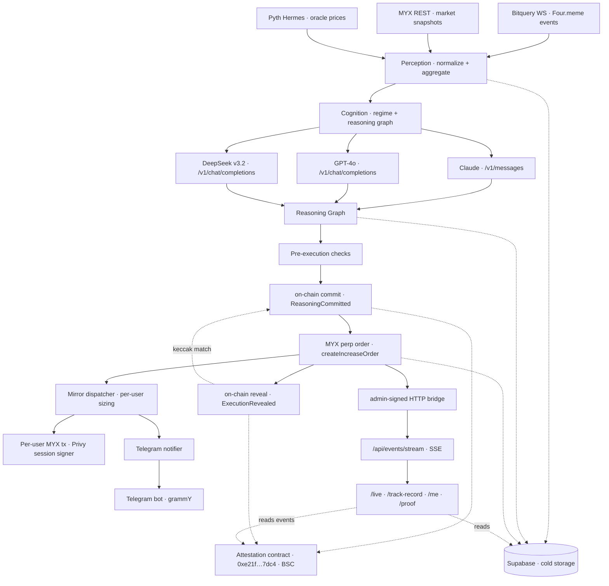

# NeuroDegen

NeuroDegen commits its reasoning hash on-chain **before** submitting each trade, then reveals the execution pointer **after** confirmation. Any observer can reconstruct the full decision-to-action chain from BscScan alone, without trusting our database, our dashboard, or our demo. The agent ingests Four.meme bonding-curve signals, reasons across three LLM providers via DGrid, executes MYX perpetual orders through the official SDK, and mirrors those orders to user wallets via Privy session signers.

The product is the composition, not the alpha. NeuroDegen does not claim profitable trading. It demonstrates end-to-end agentic execution under real conditions with a cryptographically verifiable link between each reasoning graph and the MYX order it produced.

---

## Live Deployment

| Artifact | Value |
|---|---|
| **Chain** | BNB Smart Chain (mainnet, chainId 56) |
| **Agent wallet** | [`0x9fe816A8bD6933464c177ba94890aEDE5CD5aA5A`](https://bscscan.com/address/0x9fe816A8bD6933464c177ba94890aEDE5CD5aA5A) |
| **Attestation contract** | [`0xe21f5ebec3f098c744c1e35db0c9338d6b717dc4`](https://bscscan.com/address/0xe21f5ebec3f098c744c1e35db0c9338d6b717dc4) |
| **Deploy tx** | [`0x0d1c472c...e37d64630a0`](https://bscscan.com/tx/0x0d1c472cd1cbffbdf57252e06b09295a5da8c76d709eef4360377e37d64630a0) |
| **Smoke: regime attest** | [`0x2a5720bc...eefa8c6e3f7393`](https://bscscan.com/tx/0x2a5720bcf035a4e67069b4d036f072f1ea7d26a0cf322fb657eefa8c6e3f7393) |
| **Smoke: reasoning commit** | [`0xcbd07114...91c2bd8f7f68`](https://bscscan.com/tx/0xcbd07114790424553ddcc04190931f71a428011a35dd09b3a7b591c2bd8f7f68) |
| **Smoke: execution reveal** | [`0x7dea3fc4...e409c1321d`](https://bscscan.com/tx/0x7dea3fc4c07c662aae3c076ab93468f8cd9f34cde6e203e0bd36d7e409c1321d) |

Every position open, position close, regime change, reasoning commit, and execution reveal is written to the attestation contract. Anyone can reconstruct the chain of custody from BscScan alone — or use the built-in `/proof/[myxTxHash]` page to verify a specific trade in one click.

---

## Architecture

NeuroDegen runs as two services sharing one Supabase + one attestation contract. The **worker** (Railway) holds the long-lived agent loop — Bitquery WebSocket, MYX polling, cognition cycles, execution, mirror fan-out, Telegram push. The **web** (Vercel) serves every user-facing surface — `/`, `/live`, `/track-record`, `/reasoning/[id]`, `/me`, `/proof/[txHash]` — plus admin + Telegram webhook endpoints. The worker forwards SSE events to the web over an admin-signed HTTP bridge; the web fans them out to connected browsers.



### Layer responsibilities

**Perception** — Bitquery v2 WebSocket subscriptions for five Four.meme events (TokenCreate, TokenPurchase, LiquidityAdded, PairCreated, PoolCreated). MYX REST polling for market snapshots every 15s. Pyth Hermes for BTC/ETH/BNB oracle prices. All events normalized to typed domain objects, pushed through rolling-window aggregators, flushed to Supabase in 5s batches.

**Cognition** — Three-model mixture routed through DGrid. Claude (Anthropic native `/v1/messages` format) scores narrative sentiment. GPT-4o (OpenAI-compatible `/v1/chat/completions`) extracts structured features. DeepSeek v3.2 (OpenAI-compatible) makes the binary action call. If any DGrid call fails, the fallback handler retries via direct provider APIs using operator-configured BYOK keys, so cognition never hangs on a gateway outage. Every cycle produces a `ReasoningGraph` capturing all three model calls, inputs, outputs, latencies, and aggregation logic.

**Execution** — MYX v2 perpetuals via the official `@myx-trade/sdk` (pinned `1.0.18`, single-adapter pattern). Pre-execution gate runs six sequential checks (oracle divergence, crowd score from funding rate, slippage headroom, collateral sufficiency, concurrent-position cap, cooldown). Orders are built as `PlaceOrderParams` with SDK-native decimal handling, submitted through `MyxClient.order.createIncreaseOrder`, then tracked through the full keeper state machine (submitted → pending → filled → managed → closed/expired/liquidated).

**Copy-trade monetization** — Users log in via Privy, grant a session-signer scope on their embedded wallet, and set three preferences: leverage multiplier, max position USD, and min confidence threshold. When the agent opens a position, the `MirrorDispatcher` fans out to every active subscription, runs per-user sizing (clamping to each user's limits), builds a `PlaceOrderParams`, and submits through a per-user `MyxClient` that signs with the user's Privy wallet. Users keep their own keys. The agent never holds user funds.

**Attestation** — A minimal immutable contract (`NeurodegenAttestation.sol`) emits an event for every decisive action: `PositionOpened`, `PositionClosed`, `RegimeChanged`, `ReasoningCommitted` (pre-submit, includes `reasoningHash` + `actionIntent`), and `ExecutionRevealed` (post-confirmation, links `reasoningHash` → `myxTxHash` + `orderId`). The commit-reveal pair gives an independent verifier a cryptographic timeline: the agent committed to the reasoning *before* the MYX tx was sent, and revealed the execution pointer *after* it confirmed. Anyone can audit the full chain on-chain without ever trusting our API.

---

## Verifiable proof chain

Go to `/proof/<myxTxHash>` for any NeuroDegen trade. The page:

1. Fetches the `ExecutionRevealed` event on the attestation contract.
2. Extracts the `reasoningHash` and looks up the matching `ReasoningCommitted` event.
3. Fetches the full reasoning graph from Supabase using that hash as the key.
4. Recomputes `keccak256(serialize(graph))` and verifies it matches the on-chain hash.
5. Displays commit timestamp, execution timestamp, time delta, hash match status, and a deep-link to the full reasoning view.

One-line headline: *"Reasoning was committed N seconds before execution. Hash verified."* If the hash mismatches, the page says so in red.

This closes the gap that every analytics-tool competitor leaves open: our LLM reasoning is not only auditable, it is *cryptographically tied to the on-chain action it produced*.

---

## Public track record

`/track-record` is a live ledger of every position the agent has ever opened and closed. No cherry-picking, no backtested returns — the page reads from the `positions` table and independently verifies against `PositionOpened` / `PositionClosed` events emitted on the attestation contract. You see:

- Lifetime stats: opened, closed, win rate, cumulative P&L, best / worst trade
- Per-pair breakdown with inline win-rate bars
- Most recent 20 closed trades with entry, exit, leverage, duration, exit reason, and a one-click link to `/proof/<txHash>` for each
- An "on-chain verified" banner counting the attestation events observed across the indexed block range

Auto-refreshes via SSE — when the agent closes a new position anywhere in the system, every open `/track-record` tab rerenders without a full reload.

---

## Readable reasoning

`/reasoning/[id]` is the daily-use surface for understanding *why* the agent traded. Instead of raw JSON dumps, every reasoning chain is rendered as:

- A plain-English narrative at the top: *"Perception: N launches/hr, X BNB/hr inflow, regime active. Cognition: Claude read sentiment as bullish (0.41, 72% confident). GPT-4o found 6 features weight-skewed bullish. DeepSeek voted open_long at 68% confidence. Execution: open_long BTC/USDT with $4 at 10x."*
- **Sentiment view** (Claude output) — narrative paragraph + fear/neutral/greed bar with score marker + confidence % + flagged-pattern chips
- **Features view** (GPT-4o output) — grid of feature cards with bullish/bearish/neutral tags and weight bars, aggregate totals
- **Decision view** (DeepSeek output) — action verdict + confidence bar with threshold marker + rationale + "overridden to hold" warning if below the minimum confidence threshold

Raw prompts, raw inputs, and raw model outputs are still one click away (`view raw input / output`) for reviewers who want to audit the exact bytes.

---

## Telegram notifications

Users link Telegram with one tap from `/me`. The backend mints a short-lived token, the UI opens `t.me/neurodegen_bot?start=<token>`, the bot's webhook resolves the token and writes the `user_id ↔ chat_id` binding. No copy/paste, no manual codes — the deep link is the auth.

Once linked, every event that affects the user's mirror is pushed to their chat as a rich HTML card:

| Event | What the user sees |
|---|---|
| `mirror_opened` | `🟢 LONG BTC/USDT · $4 × 10x ($40 notional) · entry $76,382 · conf 72%` + link to the proof page |
| `mirror_closed` | `✅ LONG BTC/USDT closed · +$0.12 (+3.0%) · reason: take-profit triggered` + proof link |
| `mirror_skipped` | `⏭ BTC/USDT signal skipped · reason: below 50% confidence threshold` (off by default) |
| `health_alerts` | `⚠️ perception degraded · <cause>` |
| `agent_status` | `▶️ agent started at cycle 482` / `⏸ agent stopped` |
| `daily_summary` | End-of-UTC-day digest: opens, closes, W/L, net P&L, best, worst, link to `/track-record` |

Every notification type is independently toggleable per user, both in the `/me` UI and inline inside the Telegram chat (`/settings`). The bot also accepts `/status`, `/pause`, `/resume`, `/unlink` and inline buttons for one-tap mirror control without leaving Telegram.

Implementation: [grammY](https://grammy.dev) with `webhookCallback(bot, 'std/http', { secretToken })` — the Fetch-native adapter that runs inside Next.js App Router. Telegram-side secret token validation is built in.

---

## Operational Controls

All toggles below are Railway environment variables on the **worker** service. Change a value → click **Redeploy** in Railway. No code change or git push required.

### 1. Start / Stop the Agent

The agent loop is a long-running process on Railway. To pause reasoning and execution while keeping the process alive:

```bash
POST /api/agent/start   # resume the cognition + execution cycle
POST /api/agent/stop    # pause it (perception continues in the background)
GET  /api/agent/status  # cycle count, current regime, health flags
```

All three require the `x-admin-secret` header matching `ADMIN_SECRET`.

To kill the process entirely, set Railway instances to 0 (Settings → Scaling → 0 replicas).

---

### 2. Start / Stop Trade Execution

The agent can perceive and reason without placing real orders. Two env vars control this:

| Variable | Default | Effect |
|---|---|---|
| `ENABLE_EXECUTION` | `false` | `false` = execution gateway never initializes, no orders possible |
| `DRY_RUN_MODE` | `true` | `true` = submitter returns a synthetic tx hash, MYX contract is never called |

To go live: set `ENABLE_EXECUTION=true` and `DRY_RUN_MODE=false` on the Railway worker.

---

### 3. Close a Specific Open Position

To manually close one position without stopping the agent:

```bash
POST /api/agent/close/:positionId
# Header: x-admin-secret: <ADMIN_SECRET>
```

The gateway submits a full-size decrease order and marks the position `closed` in the database.

---

### 4. AI Model Routing (DGrid → BYOK fallback)

The cognition pipeline calls three models per cycle. By default it routes through DGrid AI Gateway. When DGrid credits are depleted or you want to use your own keys:

| Variable | Default | Effect |
|---|---|---|
| `ENABLE_BYOK_ROUTING` | `false` | `true` = failed DGrid calls fall through to your own API keys |
| `ANTHROPIC_API_KEY` | — | Covers **sentiment** + **classification** — the two most important stages |
| `OPENAI_API_KEY` | — | Covers **feature extraction** only; optional — Claude handles it as final fallback |

**Only `ANTHROPIC_API_KEY` is required to unblock the pipeline.** Both keys are already present in Railway variables; you only need to flip `ENABLE_BYOK_ROUTING=true`.

---

### 5. Confidence Threshold (when the agent trades)

The classifier assigns a confidence score (0–1) per cycle. An order is only submitted when the score meets or exceeds this threshold.

| Variable | Default | Effect |
|---|---|---|
| `MIN_CONFIDENCE_TO_ACT` | `0.25` | Lower = more trades, higher false-positive risk |

Typical values:
- `0.20` — trades on moderate signals including bot-heavy markets
- `0.25` — balanced default
- `0.30` — only clean retail-driven setups

Tunable live from Railway, no redeploy needed.

---

## How it lands against each track

- **Main Sprint.** A cryptographic chain of custody from LLM reasoning to on-chain action. Every trade carries a commit-before-submit on attestation contract [`0xe21f…7dc4`](https://bscscan.com/address/0xe21f5ebec3f098c744c1e35db0c9338d6b717dc4) and a reveal-after-confirmation referencing the same `reasoningHash`. Pick any MYX tx we produced, open `/proof/<txHash>`, and verify the entire decision in one click, with no API trust.
- **MYX Finance.** Real perpetual orders through the official `@myx-trade/sdk`. The same execution gateway fans out to Privy-custodied user wallets so one agent trade mirrors to many subscribers.
- **DGrid.** Three providers wired in production: Claude on `/v1/messages`, GPT-4o and DeepSeek v3.2 on `/v1/chat/completions`. A direct-provider fallback keeps the cognition loop responsive under gateway outages.
- **Pieverse.** A proper x402 HTTP endpoint at `/api/skill` that settles in pieUSD on BSC. Payment proof is verified by fetching the tx receipt and inspecting the `Transfer` log — no shared secrets, no facilitator trust. [SKILL.md](./SKILL.md) manifest is ready for ClawHub publication pending Pieverse merchant credential verification.

---

## Quick start

### Prerequisites
- Node.js 18+
- pnpm 8+
- Supabase project (free tier)
- DGrid API key (dgrid.ai)
- Bitquery v2 Bearer token
- BSC RPC endpoint (QuickNode, Alchemy, or public)
- Privy app (privy.io) with one authorization key registered
- An EOA funded with BNB for gas

### Setup

```bash
git clone <repo-url>
cd neurodegen
pnpm install
cp .env.example .env.local
# Fill in every value — see "Environment variables" below
npx supabase db push  # runs 001 + 002 + 003 + 004
pnpm dev             # web (Next.js) — runs on :3000
# In a second terminal, to run the agent worker locally:
pnpm worker          # tsx watch + --env-file=.env.local
```

### Deploy the attestation contract

```bash
pnpm attestation:compile   # solc → artifacts/NeurodegenAttestation.json
pnpm attestation:deploy    # deploys to BSC, prints address
# copy printed address into .env.local as ATTESTATION_CONTRACT_ADDRESS
# flip ENABLE_ATTESTATION=true in src/config/features.ts
```

### Start the agent

```bash
curl -X POST http://localhost:3000/api/agent/start \
  -H "X-Admin-Secret: $ADMIN_SECRET"
```

### Verify a trade end-to-end

After the first real cycle produces a MYX order:

```bash
curl https://neurodegen.xyz/api/positions | head -n 1
# Grab a myxTxHash from the response, then visit:
# https://neurodegen.xyz/proof/<myxTxHash>
```

The proof page fetches the `ReasoningCommitted` + `ExecutionRevealed` events for that `reasoningHash`, recomputes `keccak256` of the stored reasoning graph, and confirms the on-chain hash matches — no API trust required.

### Onboard a user for copy-trade

1. Visit `/onboard`
2. Connect via Privy (email or wallet)
3. Set leverage multiplier, max position USD, min confidence
4. Approve the session-signer grant
5. Fund the displayed embedded wallet address with:
   - **BNB** for gas (~0.01 BNB covers many trades at BSC fees)
   - **USDT** for trade collateral (your chosen max position size × a few cycles)

---

## Production deployment

NeuroDegen ships as **two services** sharing one Supabase database and one BSC attestation contract:

- **`neurodegen-web`** on **Vercel** — serves the UI + API routes, including the Telegram webhook. Next.js 16 App Router.
- **`neurodegen-worker`** on **Railway** — long-running Node process that hosts the agent loop (Bitquery WS, MYX polling, cognition, execution, mirror fan-out, daily-summary scheduler).

The worker pushes every real-time event to the web service via an admin-signed HTTP bridge (`/api/events/broadcast`), which re-broadcasts over SSE to connected browsers and fans out Telegram pushes.

### 1. Supabase

Create a project and run the migrations:

```bash
supabase link --project-ref <your-project-ref>
supabase db push   # applies 001_initial + 002_copy_trade + 003_add_wallet_id + 004_telegram
```

After pushing, open **Data API → Exposed schemas** and tick the `neurodegen` schema + each of the eight tables. Then grant Postgres `USAGE` + table privileges in the SQL editor (see DEFERRED.md for the one-liner grant script).

### 2. Attestation contract (one-time)

```bash
pnpm attestation:ship    # compile + deploy to BSC
# copy the printed address → ATTESTATION_CONTRACT_ADDRESS in .env.local and Vercel + Railway env
```

Already deployed for this project at [`0xe21f5ebec3f098c744c1e35db0c9338d6b717dc4`](https://bscscan.com/address/0xe21f5ebec3f098c744c1e35db0c9338d6b717dc4).

### 3. Telegram bot (one-time)

1. Open [@BotFather](https://t.me/BotFather), run `/newbot`, pick a name + username.
2. BotFather returns an HTTP API token — keep it secret.
3. Generate a webhook secret: `openssl rand -hex 32`
4. In BotFather, run `/setcommands` → select your bot → paste:
   ```
   status - Agent + your mirror snapshot
   settings - Toggle notification types
   pause - Pause your mirroring
   resume - Resume your mirroring
   unlink - Disconnect this chat
   help - Show command list
   ```

### 4. Vercel (web)

```bash
vercel link              # link the local folder to a Vercel project
vercel --prod            # production deploy
```

Under **Project Settings → Environment Variables** (scoped to `Production`), set everything listed in the **Web env** section below. Point `neurodegen.xyz` at the project and set `NEXT_PUBLIC_APP_URL=https://neurodegen.xyz`.

After the first deploy, register the Telegram webhook **once**:

```bash
curl "https://api.telegram.org/bot${TELEGRAM_BOT_TOKEN}/setWebhook" \
  -d "url=https://neurodegen.xyz/api/telegram/webhook" \
  -d "secret_token=${TELEGRAM_WEBHOOK_SECRET}" \
  -d "allowed_updates=[\"message\",\"callback_query\"]"
```

### 5. Railway (worker)

In a new Railway project on the same repo, create a service. Under **Settings → Config-as-code Path**, point it at `/railway.worker.toml`. Railway will pick up the worker's `pnpm worker:start` entry, expose the health endpoint on `$PORT`, and restart on failure.

Set the **Worker env** variables listed below. Crucially:

- `WORKER_MODE=true` — makes `realtimeService` forward events over HTTP instead of fanning out locally (since the worker has no SSE clients of its own).
- `WEB_BROADCAST_URL=https://neurodegen.xyz/api/events/broadcast` — the web's broadcast receiver.
- `ADMIN_SECRET` — must match the web's value, or the broadcast receiver rejects the POST.

### 6. Go live

Flip execution flags in [src/config/features.ts](src/config/features.ts) and redeploy the **worker** (the web is read-only execution-wise):

```ts
export const ENABLE_EXECUTION: boolean = true;
export const DRY_RUN_MODE: boolean = false;
```

Start the agent from the web service (the request is proxied to the worker via the shared `agentLoop` singleton initialization path):

```bash
curl -X POST https://neurodegen.xyz/api/agent/start \
  -H "X-Admin-Secret: $ADMIN_SECRET"
```

First cycle with a real action produces a commit → MYX submit → reveal sequence on BscScan. Visit `/proof/<myxTxHash>` to verify, or check `/track-record` for the rolling ledger.

---

## Environment variables

See [.env.example](.env.example) for the complete, described list. Split between the two services:

### Web env (Vercel `neurodegen-web`)

| Group | Vars |
|---|---|
| **Chain** | `BSC_RPC_URL`, `BSC_RPC_URL_FALLBACK`, `BSC_LOGS_RPC_URL`, `ATTESTATION_CONTRACT_ADDRESS` |
| **LLM routing** (BYOK for proof page) | `DGRID_API_KEY`, `OPENAI_API_KEY`, `ANTHROPIC_API_KEY` |
| **Auth (Privy)** | `NEXT_PUBLIC_PRIVY_APP_ID`, `PRIVY_APP_SECRET`, `PRIVY_AUTH_PRIVATE_KEY`, `PRIVY_VERIFICATION_KEY`, `NEXT_PUBLIC_PRIVY_SIGNER_ID` |
| **Storage** | `SUPABASE_URL`, `SUPABASE_ANON_KEY`, `SUPABASE_SERVICE_ROLE_KEY` |
| **Monetization (Pieverse)** | `PIEVERSE_REVENUE_ADDRESS`, `PIEVERSE_PIEUSD_ADDRESS` |
| **Telegram** | `TELEGRAM_BOT_TOKEN`, `TELEGRAM_BOT_USERNAME`, `TELEGRAM_WEBHOOK_SECRET` |
| **Admin** | `ADMIN_SECRET` |
| **Public** | `NEXT_PUBLIC_APP_URL` |

### Worker env (Railway `neurodegen-worker`)

| Group | Vars |
|---|---|
| **Coordination** | `WORKER_MODE=true`, `WEB_BROADCAST_URL=https://<web-domain>/api/events/broadcast`, `ADMIN_SECRET` (same as web) |
| **Chain** | `BSC_RPC_URL`, `BSC_RPC_URL_FALLBACK`, `NEURODEGEN_AGENT_PRIVATE_KEY`, `ATTESTATION_CONTRACT_ADDRESS`, `MYX_BROKER_ADDRESS` |
| **Data** | `BITQUERY_API_KEY`, `BITQUERY_WS_TOKEN`, `PYTH_HERMES_URL`, `MYX_API_BASE_URL` |
| **LLM routing** | `DGRID_API_KEY`, `OPENAI_API_KEY`, `ANTHROPIC_API_KEY` |
| **Auth (Privy — for copy-trade signer)** | `PRIVY_APP_SECRET`, `PRIVY_AUTH_PRIVATE_KEY` |
| **Storage** | `SUPABASE_URL`, `SUPABASE_ANON_KEY`, `SUPABASE_SERVICE_ROLE_KEY` |
| **Telegram** (for outbound notifications) | `TELEGRAM_BOT_TOKEN`, `TELEGRAM_BOT_USERNAME` |
| **Public** | `NEXT_PUBLIC_APP_URL` (used in notification links) |

`.env.local` on your dev machine can hold the union of both — `pnpm dev` (web) and `pnpm worker` (worker) will both read what they need. Railway injects its own env vars at runtime; do not commit `.env.local`.

---

## Project structure

```
src/
├── app/
│   ├── api/
│   │   ├── agent/              # start, stop, status, trigger, close/[positionId]
│   │   ├── auth/               # session, logout
│   │   ├── events/             # stream (SSE), broadcast (worker→web bridge)
│   │   ├── health/             # cross-service health
│   │   ├── me/                 # user, positions, subscription, telegram, telegram/preferences
│   │   ├── positions/          # agent position history
│   │   ├── reasoning/          # graph list + detail
│   │   ├── skill/              # Pieverse x402
│   │   └── telegram/webhook/   # grammY webhookCallback (std/http adapter)
│   ├── live/                   # real-time perception + cognition + execution
│   ├── track-record/           # public ledger of every position, live-refresh via SSE
│   ├── reasoning/[id]/         # narrative + parsed model views + OG image
│   ├── proof/[txHash]/         # on-chain verification + OG image
│   ├── me/                     # onboarding, wallet, mirror settings, telegram, positions
│   ├── onboard/                # first-time Privy + session-signer flow
│   └── opengraph-image.tsx     # root OG
├── components/
│   ├── ui/                     # Card, Button, Badge, Skeleton, ShapeGrid (hex canvas bg)
│   ├── layout/                 # NavBar, Shell, DarkModeApplier
│   ├── providers/              # PrivyAuthProvider
│   └── features/
│       ├── auth/               # ConnectButton
│       ├── copyTrade/          # UserPositionTable, WalletCard, PreferenceRow
│       ├── perception/         # EventCard, EventFeed, AggregateMetrics
│       ├── cognition/          # RegimeIndicator, ReasoningChainView, ReasoningNarrative,
│       │                       # SentimentView, FeaturesView, ClassificationView, ModelCallDetail
│       ├── execution/          # PositionTable, PositionRow, OrderStatusBadge, RiskGauge
│       └── landing/            # HeroSection, PipelineDiagram, PartnerLogos,
│                               # LandingBackground, WhyTrustThis
├── lib/
│   ├── abis/                   # Attestation, Four.meme (MYX uses SDK)
│   ├── auth/                   # Privy session helpers
│   ├── clients/
│   │   ├── dgrid/              # claude, openai, gemini, router (BYOK Anthropic wired)
│   │   ├── byok/               # anthropicDirect fallback + primary
│   │   ├── telegram.ts         # grammY bot singleton + link URL builder
│   │   ├── chain.ts            # viem public + agent wallet + logs client
│   │   ├── myxSdk.ts           # SDK singleton (single adapter file)
│   │   ├── myxPools.ts
│   │   ├── privy.ts
│   │   ├── bitquery.ts
│   │   ├── pyth.ts
│   │   └── supabase.ts
│   ├── services/
│   │   ├── perception/         # ingester, poller, normalizer, aggregator, coldStorage
│   │   ├── cognition/          # regimeClassifier, reasoningGraphBuilder, fallbackHandler, reasoningOrchestrator
│   │   ├── execution/          # preExecutionChecker, orderBuilder, txSubmitter, positionTracker,
│   │   │                       # attestationEmitter, executionGateway (adds closeSinglePosition)
│   │   ├── monetization/       # skillWrapper, copyTradeSizing, userMyxClient, mirrorDispatcher, mirrorExit
│   │   ├── notifications/      # dispatcher, formatters, dailySummary
│   │   ├── telegram/           # botHandlers (grammY commands + callbacks)
│   │   ├── attestationHistory.ts  # on-chain event indexer for /track-record
│   │   ├── attestationReader.ts   # narrow-window log reader for /proof
│   │   ├── agentLoop.ts        # orchestrator (hot state, cognition, execution, health notifs)
│   │   └── realtimeService.ts  # env-aware: worker forwards HTTP, web fans out SSE
│   ├── queries/                # events, metrics, positions, reasoningChains,
│   │                           # subscriptions, userPositions, users, telegram
│   ├── stores/                 # In-memory hot state
│   └── utils/                  # decimalScaling, prompts, validation, reasoningHash, format, cn
├── hooks/                      # useSSE, useAgentStatus, usePositions, useMe,
│                               # useWalletBalances, useTelegramLink
├── worker/                     # Railway long-running entry — agentLoop + dailySummary scheduler
├── types/                      # perception, cognition, execution, myx, users, telegram, pieverse
└── config/                     # all tunable parameters (risk retuned for $10 agent wallet)

contracts/
└── NeurodegenAttestation.sol   # Immutable attestation contract (commit-reveal extended)

supabase/migrations/
├── 001_initial_schema.sql
├── 002_copy_trade.sql
├── 003_add_wallet_id.sql
└── 004_telegram.sql            # telegram_link_tokens + telegram_subscriptions + notifications_log

railway.toml                    # web service config
railway.worker.toml             # worker service config (point Railway 2nd service here)
```

---

## Tech stack

- **Next.js 16.2.3** (App Router, Turbopack) / **TypeScript** (strict, ES2020)
- **viem 2.47.17** — chain interactions
- **@myx-trade/sdk 1.0.18** — perpetual orders (pinned exact)
- **@privy-io/react-auth 3.22.1** + **@privy-io/node 0.15.0** — embedded wallets + session signers
- **DGrid** — multi-model inference router
- **Anthropic SDK** — direct BYOK fallback for cognition
- **Bitquery v2** — Four.meme event stream (GraphQL + WS)
- **Pyth Hermes** — oracle price feeds
- **Supabase** (Postgres) — cold storage + auth session cookies
- **Tailwind CSS v4** — `@theme` CSS-based config
- **solc 0.8.28** — attestation contract compilation
- **Vercel** — hosting

---

## API surface

| Route | Method | Auth | Purpose |
|---|---|---|---|
| `/api/agent/status` | GET | Public | Live agent status + regime |
| `/api/agent/start` | POST | Admin | Start the agent loop |
| `/api/agent/stop` | POST | Admin | Stop the agent loop |
| `/api/agent/trigger` | POST | Admin | Force one cycle |
| `/api/agent/close/[positionId]` | POST | Admin | Close a single open position without stopping the agent |
| `/api/reasoning` | GET | Public | Recent reasoning chains |
| `/api/reasoning/[id]` | GET | Public | One reasoning chain |
| `/api/positions` | GET | Public | Agent's position history |
| `/api/events/stream` | GET | Public | SSE feed of perception/cognition/execution events |
| `/api/events/broadcast` | POST | Admin | Worker → web event relay (internal) |
| `/api/health` | GET | Public | Cross-service health |
| `/api/auth/session` | POST | Privy token | Upsert user on first login |
| `/api/auth/logout` | POST | Session cookie | Clear cookie |
| `/api/me` | GET | Session cookie | User + subscription |
| `/api/me/subscription` | GET / PATCH | Session cookie | Read or update mirror prefs |
| `/api/me/positions` | GET | Session cookie | User's mirror positions |
| `/api/me/telegram` | GET / POST / DELETE | Session cookie | Read link status / mint link token / unlink |
| `/api/me/telegram/preferences` | PATCH | Session cookie | Toggle notification types |
| `/api/telegram/webhook` | POST | Bot secret token | grammY webhook (command + callback handlers) |
| `/api/skill` | POST | x402 | Pieverse command endpoint |
| `/opengraph-image` | GET | Public | Root OG card |
| `/reasoning/[id]/opengraph-image` | GET | Public | Per-chain OG (action + pair + confidence + rationale) |
| `/proof/[txHash]/opengraph-image` | GET | Public | Per-proof OG (side + pair + size + leverage) |

---

## Team

- **Winszn** — sole author: architecture, perception, cognition, execution, on-chain attestation, copy-trade layer, frontend, submission

## License

[AGPL-3.0](./LICENSE) — if you run a modified copy as a network service, you must make the source available to its users. Chosen over MIT so a forked agent can't privatize the commit-reveal attestation system behind a closed dashboard.
