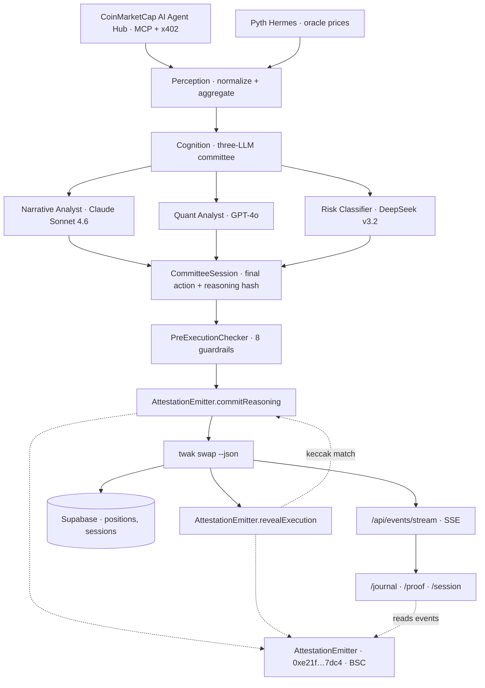

# NeuroDegen V2

An autonomous **investment-committee trading agent** for BNB Chain. Submission to the BNB Hack: AI Trading Agent Edition (CoinMarketCap × Trust Wallet × BNB Chain).

NeuroDegen runs a three-LLM committee - narrative analyst, quant analyst, risk classifier - that ingests live CoinMarketCap data via the CMC AI Agent Hub, executes BEP-20 swaps **only through Trust Wallet Agent Kit (TWAK)**, and commits its reasoning hash on-chain **before** every trade so any observer can independently reconstruct the decision-to-action chain from BscScan alone.

**The product is the composition, not the alpha.** This codebase makes no profitability claim. It demonstrates an end-to-end autonomous agent under self-custody, with hard guardrails (149-token allowlist, drawdown ladder, slippage caps, EV-gated outbound payments) and a cryptographically verifiable audit trail across three independent on-chain rails.

---

## For judges (human or AI)

Six short docs, each one cites file:line so claims can be audited without trusting this README.

| Document | What's in it |
|---|---|
| [HOW_IT_WORKS.md](HOW_IT_WORKS.md) | Plain-English walkthrough of the whole product: what it is, what happens during one cycle, where each part lives in code, how to spin it up yourself, what to look at to know it is working, what breaks and what to do |
| [ARCHITECTURE.md](ARCHITECTURE.md) | Layered three-rail design (commit-reveal + ERC-8183 commerce + ERC-8004 identity), async patterns, restart-safe state, the 8-flag `/proof` verification |
| [SECURITY.md](SECURITY.md) | Self-custody integrity proof, hard "never X" constraints with enforcers, TOCTOU protections, prompt-injection mitigations, known gaps |
| [ADVERSARIAL_TESTING.md](ADVERSARIAL_TESTING.md) | Phase E/F/G/H multi-agent skeptic audit receipts (32/32, 5/5, 8/8 claims confirmed), test design philosophy, gaps we accept |
| [SUBMISSION.md](SUBMISSION.md) | DoraHacks submission package, pre-deploy checklist, per-special scoring map, operator runbook |
| [LICENSE](LICENSE) | AGPL-3.0-only |

Source-of-truth: this is open-source. Fork it, point at your own TWAK wallet, redeploy on Railway, and run your own verifiable agent.

---

## Who is this for

NeuroDegen is a **spectator product + reference implementation**, not a consumer app:

1. **Agent builders** who want to deploy a verifiable trading agent under their own self-custody. Fork the repo, point at your own TWAK wallet, set your own mandate, register on the competition contract - your agent inherits the same on-chain audit guarantees.
2. **Self-custody power users** who refuse to trust opaque "alpha bots" and want to watch / read / pay an agent whose every decision is cryptographically anchored to BSC events.
3. **Researchers + auditors** who want a working composition of EIP-8004 (identity), EIP-8183 (agentic commerce), x402 (micropayments), and TWAK self-custody signing - all wired and running.

What this is NOT (deliberate scope choices):

- **Not a copy-trade product.** V1 had a Privy-based mirror dispatcher. V2 explicitly removed it (deferred to V2.1) because we couldn't preserve self-custody integrity for both the agent AND user wallets within the comp window. Spectators pay 0.01 USDT to read a session via x402, full stop.
- **Not an alpha product.** No profitability claim. Ever.

---

## Competition compliance

| Requirement | How NeuroDegen satisfies it |
|---|---|
| Self-custody (TWAK) | The TWAK CLI is the **sole signing path** for every trade. The Node worker never touches a private key. ([src/lib/services/execution/twakExecutor.ts](src/lib/services/execution/twakExecutor.ts)) |
| On-chain agent registration | Worker calls `twak compete register --json` on first boot, persists the tx hash and participant address to `worker_state`. Idempotent across restarts; refuses to register after the deadline. ([src/lib/services/competitionRegistration.ts](src/lib/services/competitionRegistration.ts)) |
| 149-token allowlist | Loaded from `ALLOWED_TOKENS_JSON` env at boot; `PreExecutionChecker.allowedTokenVerified()` rejects out-of-list symbols **before** any TWAK swap call. ([src/lib/services/execution/preExecutionChecker.ts](src/lib/services/execution/preExecutionChecker.ts)) |
| ≥1 trade per UTC day | `probeTradeScheduler` fires a TWAK round-trip at 18:00 UTC if no qualifying trade has been recorded for the current day. `lastProbeDay` is persisted to Postgres so a worker restart cannot double-fire. ([src/lib/services/execution/probeTradeScheduler.ts](src/lib/services/execution/probeTradeScheduler.ts)) |
| Drawdown disqualifier (30%) | Five-tier ladder (`normal/alert/defensive/halt/disqualified`) in `riskManager.classifyDrawdownTier`. Halt at 25% (competition floor), DQ at 30%, user mandate can tighten further. ([src/lib/services/execution/riskManager.ts](src/lib/services/execution/riskManager.ts)) |
| Slippage protection | `MAX_SLIPPAGE_PCT` is enforced on every swap via TWAK's `slippagePct` parameter. ([src/config/execution.ts](src/config/execution.ts)) |
| Native x402 | Both directions. **Inbound**: `/api/x402/session/[id]` sells session data via USDT-on-BSC micropayments (atomic proof recording). **Outbound**: the CMC AI Agent Hub client pays per premium tool call through `twak x402 request`. ([src/app/api/x402/session/[id]/route.ts](src/app/api/x402/session/%5Bid%5D/route.ts), [src/lib/clients/cmcHubClient.ts](src/lib/clients/cmcHubClient.ts)) |

---

## Live deployment

| Artifact | Value |
|---|---|
| Chain | BNB Smart Chain mainnet (chainId 56) |
| **Agent wallet (TWAK signer)** | [`0x1a59eD9BB4890a8ac02746BFC00EDeCBBBe375fF`](https://bscscan.com/address/0x1a59eD9BB4890a8ac02746BFC00EDeCBBBe375fF) |
| Competition registration tx | [`0x505c22f5…6358ed13`](https://bscscan.com/tx/0x505c22f537990841fb623b636521028984e13be7570840a49c6bd8e06358ed13) |
| Competition contract | [`0x212c61b9b72c95d95bf29cf032f5e5635629aed5`](https://bscscan.com/address/0x212c61b9b72c95d95bf29cf032f5e5635629aed5) |
| **V2 AttestationEmitter** (verified) | [`0xf3ac420e9bd8bb63f42cb6678126dc78c69deba3`](https://bscscan.com/address/0xf3ac420e9bd8bb63f42cb6678126dc78c69deba3#code) |
| V2 deploy tx | [`0x84e19526…a6d027d7`](https://bscscan.com/tx/0x84e195266c47c2c2eb4ac80122e340bd52bec897aa505fa85ce0f178a6d027d7) |
| ERC-8004 identity (agentId **139974**) | [`0xd1afd2b3…ca389b2f`](https://bscscan.com/tx/0xd1afd2b3a23700f4cf74b75d9fe7b8365dca5c6ec237c1662846a2ffca389b2f) |
| ERC-8004 registry | [`0x8004A169FB4a3325136EB29fA0ceB6D2e539a432`](https://bscscan.com/address/0x8004A169FB4a3325136EB29fA0ceB6D2e539a432) |
| ERC-8183 commerce | [`0xea4daa3100a767e86fded867729ae7446476eba6`](https://bscscan.com/address/0xea4daa3100a767e86fded867729ae7446476eba6) |
| Agent card (EIP-8004 v1) | [`/api/agent-card`](https://neurodegen.xyz/api/agent-card) |
| Web | [neurodegen.xyz](https://neurodegen.xyz) |
| Verify any trade | `https://neurodegen.xyz/proof/<twakTxHash>` |
| Registration status | `GET https://neurodegen.xyz/api/health` |

The `/proof/[twakTxHash]` page reads the AttestationEmitter contract events for the matching reasoning hash, recomputes the hash from the persisted DB row, and shows a flag-by-flag verdict (hash recomputes, commit found, reveal found, commit landed before reveal, on-chain myxTxHash matches the swap). No trust in our database, dashboard, or demo is required - every flag is independently verifiable on BscScan.

---

## Architecture

NeuroDegen runs as two Railway services sharing one Supabase database and one BSC attestation contract.

- **Worker** (`src/worker/index.ts`) - long-lived agent loop. Boot-time competition registration, perception ingestion from CMC, three-LLM committee deliberation, TWAK swap execution, commit-reveal attestation, daily probe scheduling.
- **Web** (`src/app/`) - Next.js 16 App Router. SSE relay, public health/proof/journal pages, inbound x402 endpoint, admin proxy to the worker.


```mermaid
flowchart TD
  CMC["CoinMarketCap AI Agent Hub · MCP + x402"] --> PERC
  PYTH["Pyth Hermes · oracle prices"] --> PERC

  PERC["Perception · normalize + aggregate"] --> COG["Cognition · three-LLM committee"]

  COG --> NA["Narrative Analyst · Claude Sonnet 4.6"]
  COG --> QA["Quant Analyst · GPT-4o"]
  COG --> RC["Risk Classifier · DeepSeek v3.2"]
  NA --> SESSION
  QA --> SESSION
  RC --> SESSION

  SESSION["CommitteeSession · final action + reasoning hash"] --> PRE
  PRE["PreExecutionChecker · 8 guardrails"] --> COMMIT
  COMMIT["AttestationEmitter.commitReasoning"] --> TWAK
  TWAK["twak swap --json"] --> REVEAL
  REVEAL["AttestationEmitter.revealExecution"]
  REVEAL -.->|keccak match| COMMIT

  TWAK --> SB[("Supabase · positions, sessions")]
  TWAK --> SSE["/api/events/stream · SSE"]
  SSE --> UI["/journal · /proof · /session"]

  COMMIT -.-> ATT["AttestationEmitter · 0xe21f…7dc4 · BSC"]
  REVEAL -.-> ATT
  UI -.->|reads events| ATT
```

### Layer responsibilities

**Perception** - CMC AI Agent Hub via MCP JSON-RPC `tools/call`. Free tier for baseline data; premium tools (deep social, KOL activity, security-risk score) gated through TWAK x402. Pyth Hermes for BTC/ETH/BNB oracle prices used in the divergence check. Outputs an `AggregateMetrics` snapshot per cycle: regime, fear & greed, top movers, KOL activity, funding rates, market liquidity score, security-risk per candidate token.

**Cognition** - Three independent LLM members, each with a single role:

- **Narrative Analyst** (Claude Sonnet 4.6) - `narrativeSummary`, `sentimentScore`, `confidenceLevel`, `direction`, `flaggedAnomalies`, `topThesisToken`.
- **Quant Analyst** (GPT-4o) - `features`, `dominantDirection`, `liquidityAdequate`, `fundingRateWarning`, `recommendedToken`.
- **Risk Classifier** (DeepSeek v3.2) - receives both analysts' outputs plus the dissent verdict, emits the final `action ∈ {open_long, close_position, adjust_parameters, hold}` with `targetToken` and `confidence`.

All three are routed through the [DGrid](https://dgrid.ai) LLM gateway with a BYOK → DGrid primary → DGrid fallback chain. The dissent tracker collapses the analyst pair into a half-size or hold modifier; analyst parse-failures are treated as hidden dissent (no false unanimity). Every session is canonicalized and keccak-hashed; the hash is the on-chain attestation primary key.

**Execution** - `twakExecutor.execute()` is the only path to a signed BSC transaction. Eight pre-execution checks fire in sequence (oracle divergence, security-risk score, honeypot flag, slippage headroom, allowlist membership, drawdown tier, daily PnL cap, exposure cap). On pass, the executor commits the reasoning hash on-chain, calls `twakClient.executeSwap()` (TWAK CLI → BSC), then reveals the execution pointer linking `reasoningHash → twakTxHash`.

**Attestation** - A minimal immutable Solidity contract (`NeurodegenAttestation.sol`) emits five event types: `RegimeChanged`, `PositionOpened`, `PositionClosed`, `ReasoningCommitted` (pre-submit, includes `reasoningHash` + `actionIntent`), `ExecutionRevealed` (post-confirmation, links `reasoningHash` → `twakTxHash`). The contract is verified on BscScan and read directly by the `/proof` page so verification doesn't depend on our database.

**Risk** - Mandate-aware ladder with a global competition-survival floor:

| Drawdown | Tier | Behaviour |
|---|---|---|
| < 15% | normal | full size |
| 15–20% | alert | 50% size |
| 20–25% | defensive | close-only (no new opens) |
| 25–30% | halt | all execution blocked |
| ≥ 30% | disqualified | competition-fixed |

Plus per-cycle: max 5 concurrent positions, daily PnL cap, mandate-driven consecutive-loss halt, per-position size cap, per-token max exposure ratio, and a live total-exposure cap derived from the actual open-position book (not stale state).

---

## Reasoning gateway - DGrid is primary

Every committee cycle (narrative + quant + risk) routes through the **DGrid LLM gateway** as the primary path. BYOK Anthropic + OpenAI keys, if set, are tried as a fallback ONLY. The risk classifier (DeepSeek v3.2) has no BYOK path and **always** uses DGrid.

| Analyst | Primary | Fallback |
|---|---|---|
| Narrative (Claude Sonnet 4.6) | DGrid `anthropic/claude-sonnet-4.6` | BYOK `ANTHROPIC_API_KEY` → DGrid `claude-haiku-4.5` |
| Quant (GPT-4o) | DGrid `openai/gpt-4o` | BYOK `OPENAI_API_KEY` → DGrid `openai/gpt-4o-mini` |
| Risk (DeepSeek v3.2) | DGrid `deepseek/deepseek-v3.2` | DGrid `openai/gpt-4o-mini` |

To invert (BYOK first), set `PREFER_BYOK_ROUTING=true`. To shut DGrid off entirely, set `DISABLE_DGRID_ROUTING=true`. Both are documented in [.env.example](.env.example).

The router preflight ([src/lib/clients/llm/router.ts:103-178](src/lib/clients/llm/router.ts#L103-L178)) checks env-set on each candidate and walks the chain; on success it records `routingDecision` (`'dgrid_primary' | 'dgrid_fallback' | 'direct'`) into the session row so `/journal` shows which gateway carried each call.

---

## Observability + transparency

- `/api/health` - env preflight, worker reachability, database health, competition registration state, preflight issues (loud if trading window opens with no registration or with `DRY_RUN_MODE=true`)
- `/api/events/stream` - SSE feed of `perception_event`, `committee_session_complete`, `position_update`, `regime_change`, `health_degradation`, `agent_status_snapshot`
- `/journal` - paginated session log with reasoning hash, on-chain commit/reveal txs, dissent verdict, plain-language explanation
- `/session/[id]` - full committee session detail: each analyst's prompt, raw model output, parsed JSON, latency, cost
- `/proof/[twakTxHash]` - independent on-chain verification

---

## BNB AI Agent SDK integration

NeuroDegen integrates the [BNB AI Agent SDK](https://github.com/bnb-chain/bnbagent-sdk) at two layers via the corresponding TWAK CLI subcommands (`twak erc8004 …`, `twak erc8183 …`, `twak wallet sign-message`). **TWAK remains the sole signing path** - the Node worker never touches a private key for any of the SDK calls.

### ERC-8004 - agent identity

At first boot the worker calls `twak erc8004 register` with a `data:application/json;base64,…` agent card embedding the canonical EIP-8004 type. The resulting `agentId` is persisted to `worker_state` so subsequent boots are no-ops. Registration is idempotent, has no deadline, and is non-fatal on failure. See [src/lib/services/bnbAgentRegistration.ts](src/lib/services/bnbAgentRegistration.ts).

The agent card declares three supportedTrust profiles:

- `erc-8004-identity` - this registration
- `erc-8183-commerce` - the per-decision job lifecycle below
- `neurodegen-attestation-commit-reveal` - the AttestationEmitter pattern

### ERC-8183 - agentic commerce per committee decision

When `ENABLE_ERC8183_JOBS=true` and the agent wallet holds U-tokens (`0xcE24439F…666666`, 18 dec), each executed committee decision triggers a **self-employed job lifecycle**: the agent's TWAK wallet is both the client and the provider. After the TWAK swap lands and the reveal attestation fires, the agent runs:

1. **Negotiate** - build a `NegotiationContent` JSON (task, terms, deliverables, success_criteria), canonicalise via sorted-key JSON, keccak256 the canonical bytes, sign the digest via `twak wallet sign-message` (EIP-191 personal_sign) - the `provider_sig` proves the agent agreed to its own price before funding.
2. **Create** - `twak erc8183 create-job` with `provider = agent wallet`, `evaluator = OptimisticPolicy`, `expiredAt = now + 24h`, `description` encoding both the negotiation hash and the reasoning hash.
3. **Budget + Fund** - `twak erc8183 set-budget` then `twak erc8183 fund` for `ERC8183_JOB_BUDGET_WEI` (default `1e16` = 0.01 U).
4. **Submit** - build a `DeliverableManifest` JSON embedding `{reasoningHash, twakTxHash, attestationCommitTx, attestationRevealTx, action, confidence, executedAt}`, canonicalise + keccak256 → `bytes32 deliverable`, call `twak erc8183 submit`.

The 7-day OptimisticPolicy dispute window then acts as a tamper-evident time-locked audit trail: anyone can settle the job after the window closes, and the on-chain `JobSubmitted(jobId, provider, deliverable)` event hash matches `keccak256(canonical(manifest))` byte-for-byte.

Fire-and-forget from `agentLoop`: any failure logs but never blocks the next cycle. See [src/lib/services/agenticCommerce.ts](src/lib/services/agenticCommerce.ts).

### Why this composition wins "most inventive"

Three on-chain protocols layered for **redundant verifiability** of the same decision:

| Protocol | What it proves |
|---|---|
| **AttestationEmitter** (custom) | The reasoning hash was committed BEFORE the TWAK swap, then revealed AFTER it confirmed |
| **ERC-8183 agentic commerce** | The committee was paid to execute the decision, agreed to its own price off-chain, and submitted a manifest whose hash recomputes from the persisted session row |
| **ERC-8004 identity** | The wallet that committed, executed, and submitted is the same registered agent identity |

Anyone can independently reconstruct the decision-to-execution chain from BscScan alone, cross-checking three distinct contracts - without ever calling our API.

---

## x402 in the trade loop

**Outbound** - Cognition calls into CMC's premium MCP tools (e.g. deep social, KOL velocity, token security score) only when the EV gate says the expected information value clears the micropayment cost. Each x402 call goes through `twak x402 request --max-payment` so payment authorisation never leaves the agent wallet. Daily spend tracker enforces a hard cap.

**Inbound** - `GET /api/x402/session/[id]` returns a `402 Payment Required` challenge with a USDT-on-BSC recipient + amount when called without an `X-Payment-Proof` header. With a valid USDT transfer receipt to the configured revenue address, the proof is atomically inserted to `consumed_x402_proofs` (race-safe via primary-key unique violation) and the session is returned. The revenue address is normalised via `getAddress()` at module load so case-mismatched env vars surface immediately.

---

## Repository layout

```
src/
  app/                 Next.js 16 routes: /journal, /session, /proof, /api/*
  config/              chains, competition, execution, risk, monetization, cognition
  lib/
    clients/           cmcHubClient, twakClient, llm/{router,openaiClient,dgrid,anthropic}, pyth, chain, supabase
    queries/           positions, sessions, x402proofs, workerState, metrics, perceptionEvents
    services/
      agentLoop.ts     main orchestrator
      competitionRegistration.ts
      bnbAgentRegistration.ts        # ERC-8004 identity (boot-time, idempotent)
      agenticCommerce.ts             # ERC-8183 job lifecycle (per-decision, opt-in)
      cognition/       narrativeAnalyst, quantAnalyst, riskClassifier, dissentTracker, committeeSession, sessionGraphBuilder
      execution/       twakExecutor, attestationEmitter, preExecutionChecker, riskManager, positionTracker, probeTradeScheduler
      attestationReader.ts  on-chain commit/reveal scanner used by /proof
    stores/            hotState (eviction-safe SSE relay)
    utils/             adminAuth (constant-time), allowedTokens, canonicalSerialize, prompts (sanitised)
  types/               cognition, execution, perception, mandate, monetization
  worker/index.ts      worker entrypoint (HTTP /health + /admin/* + boot-time competition registration)
contracts/             NeurodegenAttestation.sol + deploy scripts
supabase/migrations/   schema + RLS policies
```

---

## Local development

```bash
pnpm install
pnpm tsc --noEmit          # type-check
pnpm vitest run            # unit + integration tests (117 passing)
pnpm build                 # next build
pnpm dev                   # web (port 3000)
pnpm worker                # agent worker (port 8080, env from .env.local)
```

### Required env

```
# Database
SUPABASE_URL=
SUPABASE_SERVICE_ROLE_KEY=
NEXT_PUBLIC_SUPABASE_URL=

# Chain
BSC_RPC_URL=
ATTESTATION_CONTRACT_ADDRESS=0xf3ac420e9bd8bb63f42cb6678126dc78c69deba3
ATTESTATION_DEPLOY_BLOCK=105434008
COMPETITION_CONTRACT_ADDRESS=0x212c61b9b72c95d95bf29cf032f5e5635629aed5

# TWAK (self-custody)
TWAK_BIN=twak                          # path to TWAK CLI
TWAK_AGENT_WALLET_ADDRESS=0x...        # provisioned by `twak wallet create`

# CMC Hub
CMC_PRO_API_KEY=
CMC_X402_ENDPOINT=                     # premium tools endpoint

# LLM (BYOK preferred; DGrid is fallback)
DGRID_API_KEY=
ANTHROPIC_API_KEY=                     # optional BYOK
OPENAI_API_KEY=                        # optional BYOK
DEEPSEEK_API_KEY=                      # optional BYOK

# Worker ↔ web
ADMIN_SECRET=                          # constant-time compared via crypto.timingSafeEqual
WEB_BROADCAST_URL=                     # web's /api/events/broadcast
WORKER_ADMIN_URL=                      # web → worker /admin proxy target

# Competition + safety
ALLOWED_TOKENS_JSON=                   # 149-token list
ENABLE_EXECUTION=true
ENABLE_PROBE_TRADE=true
DRY_RUN_MODE=false                     # MUST be false during the live window
COMPETITION_REGISTRATION_DEADLINE=2026-06-22T00:00:00Z
COMPETITION_TRADING_WINDOW_START=2026-06-22T00:00:00Z
COMPETITION_TRADING_WINDOW_END=2026-06-28T23:59:59Z

# BNB AI Agent SDK
ENABLE_ERC8004_REGISTRATION=true       # publishes the agent identity on boot
ENABLE_ERC8183_JOBS=false              # flip true after funding the wallet with U-tokens
ERC8183_JOB_BUDGET_WEI=10000000000000000  # 0.01 U per job (1 U funds 100 jobs)

# x402 inbound (optional revenue)
ENABLE_X402_INBOUND=false
X402_REVENUE_ADDRESS=                  # checksummed; normalized at module load
```

---

## Hardening summary

Phase E (the audit-driven production-hardening pass) landed 22 fixes, verified by an adversarial multi-agent workflow with 32/32 claims confirmed. Highlights:

- Concurrency: re-entrancy guards on cycle and regime evaluation; portfolio-NaN guards; hotState evict snapshot-before-delete; live-derived exposure
- x402: atomic proof insertion (`recordProof` IS the check, no TOCTOU); checksummed revenue-address normalisation
- Admin auth: `crypto.timingSafeEqual` everywhere (`src/lib/utils/adminAuth.ts`)
- Cognition: quant prompt sanitization parity with narrative; `computeDissent` parse-status awareness (no false unanimity); quiet-regime `$0` collapse-to-hold (no misleading "Committee opened …" explanation)
- Resilience: `Promise.allSettled` analyst fan-out with synthetic-neutral fallback; session-number collision retry with **hash rebuild** (preserves on-chain integrity); `DRY_RUN` flag on every execution record
- Persistence: `worker_state` table for restart-safe probe scheduler + competition registration
- Observability: refreshed 2026 LLM rate card; `health_degradation` SSE on CMC-null skip

See `git log --oneline` for the per-phase commits (Phase A+B, Phase C, Phase E).

---

## Disclaimers

This is competition code, not investment advice. The agent trades real BNB Smart Chain assets autonomously; assume losses are possible and uncapped beyond the 30% disqualification floor. The agent will not trade tokens outside the 149-token allowlist, will not submit transactions outside TWAK, and will not bypass `PreExecutionChecker`. No user funds are held; the agent operates only on its own TWAK wallet.

## License

AGPL-3.0-only. Full text at [LICENSE](LICENSE). Source-available; modifications must remain under AGPL.
